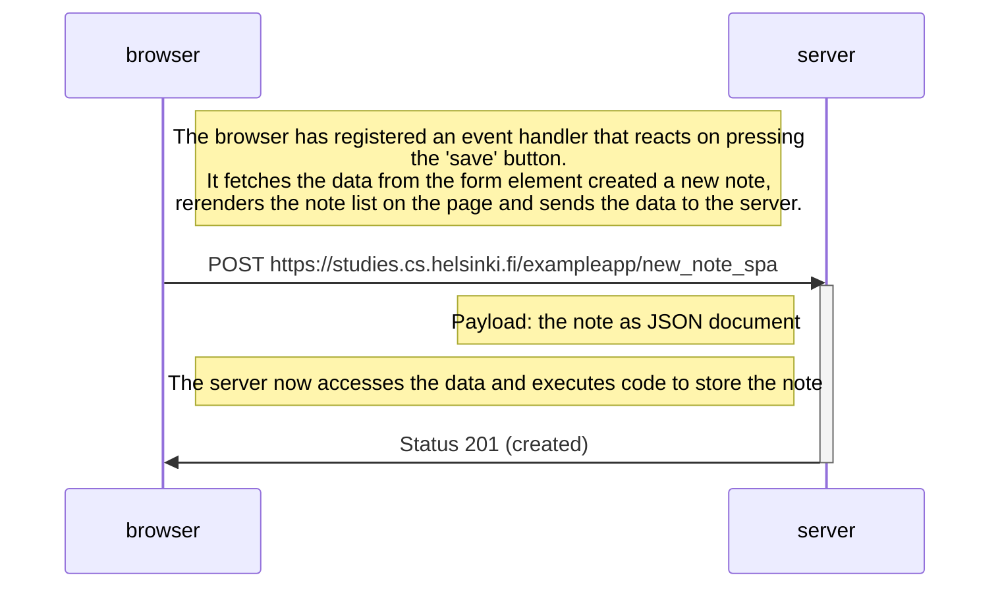

```mermaid
sequenceDiagram
    participant browser
    participant server

    Note right of browser: The browser has registered an event handler that reacts on pressing<br />the 'save' button.<br />It fetches the data from the form element created a new note,<br />rerenders the note list on the page and sends the data to the server. 
    browser->>server: POST https://studies.cs.helsinki.fi/exampleapp/new_note_spa
    activate server
    Note left of server: Payload: the note as JSON document
    Note left of server: The server now accesses the data and executes code to store the note
    server->>browser: Status 201 (created)
    deactivate server

```
